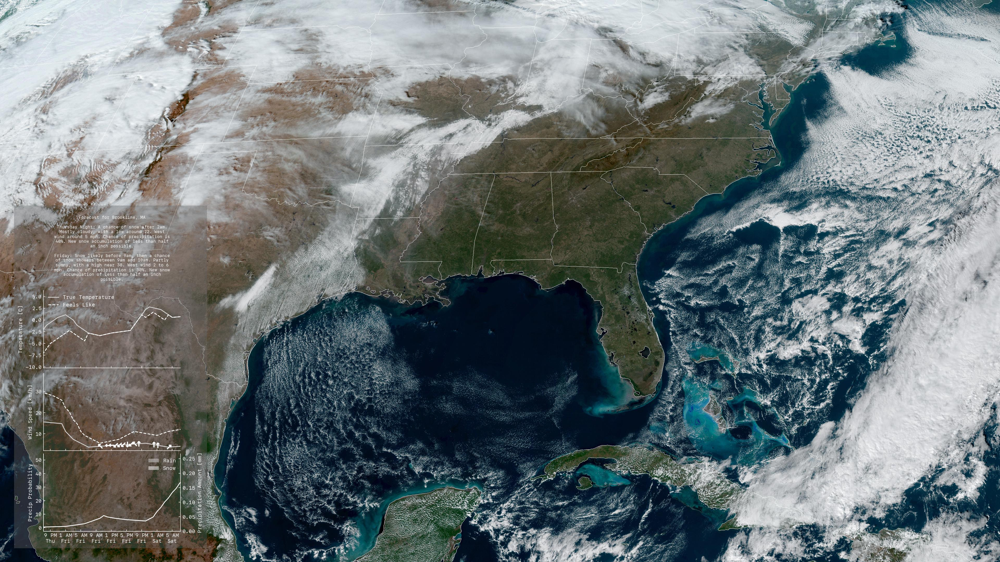

NWS Wallpaper
=============

A little personal project for setting your wallpaper automatically
to the NWS GeoColor
[GOES-East CONUS image](https://www.star.nesdis.noaa.gov/GOES/conus.php?sat=G16)
every hour, along with a little forecast composited on top.

Example:

The project uses python3. Currently, it can only set your wallpaper
automatically if you are on MacOS.

You'll need the usual libraries, along with `pillow`.

This takes the data directly from NWS' API.

To use this, you'll need to:

1. Change the python script `plot_forecast.py` to use your latitude
   and longitude.
2. Change `make_background.sh` to use your username, and if you're on
   linux, figure out what command automaically sets your wallpaper.
3. Set a cron job to do this automatically for you every hour.